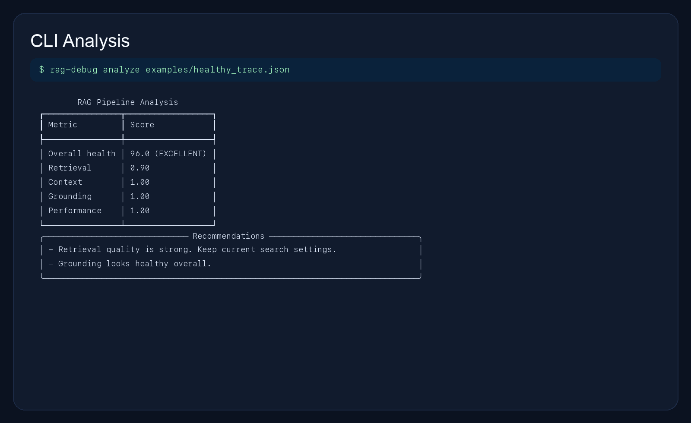
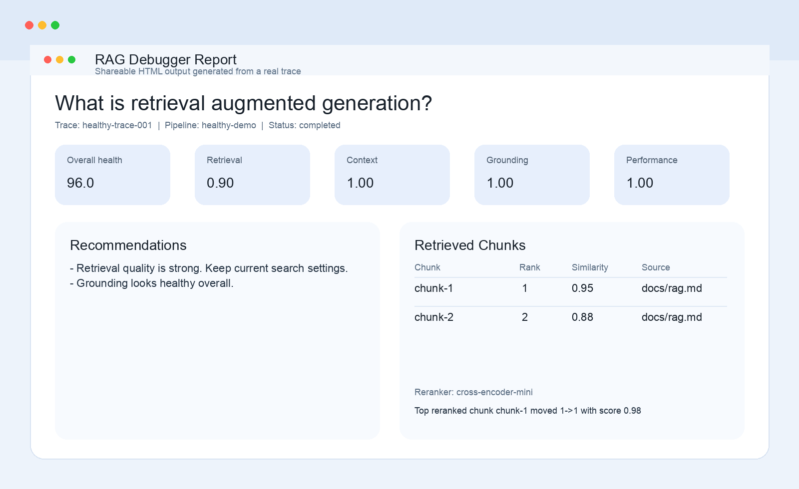
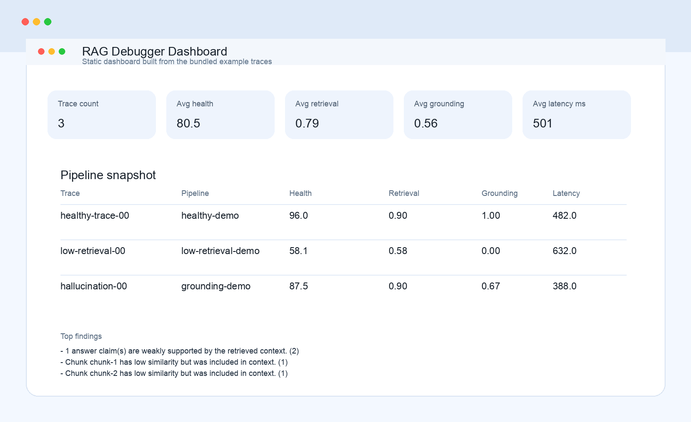
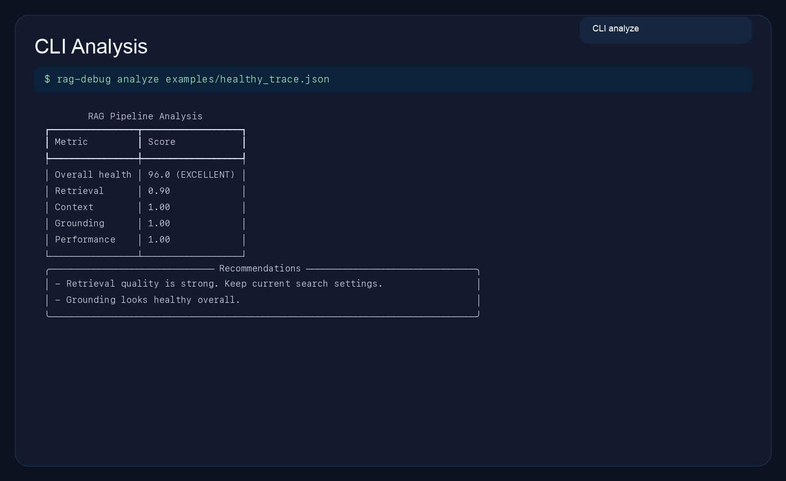

# RAG Debugger

RAG Debugger is a Python library and CLI for understanding why a Retrieval-Augmented Generation pipeline succeeds or fails.

It helps developers answer questions like:

- Did retrieval return the wrong chunks?
- Did reranking improve or hurt the result?
- Did the final context drop useful evidence?
- Is the answer grounded in the retrieved context?
- Did a pipeline change make quality worse?

The tool is built for local debugging first: trace a RAG run, save it as JSON, and inspect it with `rag-debug`.

## New To This?

If you are a beginner, here is the simplest way to think about this project:

- your RAG app answers a question
- RAG Debugger records what happened during that answer
- it saves that run as a trace file
- you inspect that trace to see what went wrong

In plain words, it helps you answer:

- did my app retrieve the right information?
- did it put the right chunks into the prompt?
- did the model answer from the evidence, or make something up?

You do not need to understand every file in this repo to use it.

Start with the demo, then move to your own app.

## 5-Minute Quickstart

If you want to try the project without integrating anything yet:

```bash
git clone https://github.com/Shivankneelamgarg/rag-debugger
cd rag-debugger
python3 -m venv .venv
source .venv/bin/activate
pip install -e ".[dev]"
python examples/example_app.py
rag-debug analyze examples/generated/when_was_the_company_founded.json
```

What will happen:

- the demo app will run a tiny fake RAG pipeline
- it will create trace files in `examples/generated/`
- `rag-debug analyze ...` will show a score and recommendations

If that works, the package is installed correctly and you are ready to try it on your own RAG app.

## Available Now

What is available in this repo today:

- core trace models for query, embedding, retrieval, reranking, context, and LLM output
- `RAGTracer` for manual tracing, context-manager tracing, and decorator-based tracing
- `AutoInstrumentedRAGPipeline` for deeper framework auto-instrumentation around callable RAG components
- trace save and load support for `json` and `jsonl`
- analysis for retrieval quality, context pressure, grounding, numeric-claim mismatches, latency, tokens, and cost
- CLI commands:
  - `rag-debug view`
  - `rag-debug analyze`
  - `rag-debug stats`
  - `rag-debug aggregate`
  - `rag-debug team-report`
  - `rag-debug diff`
  - `rag-debug explain`
  - `rag-debug dashboard`
  - `rag-debug serve-dashboard`
  - `rag-debug export`
- HTML report export
- static HTML dashboard export
- live auto-refreshing dashboard server
- LangChain adapter helpers
- LlamaIndex adapter helpers
- stronger explanation providers with heuristic, structured, and external-provider modes
- richer team analytics with grouped metrics, tag counts, trend points, and top findings
- example trace files for healthy, weak-retrieval, and grounding-problem scenarios
- tested local package install with passing test suite
- GitHub Actions for tests, package validation, and release publishing

## What It Is

RAG Debugger is not a chatbot and not a vector database.

It sits around an existing RAG application and records what happened during a query:

1. user query
2. embedding step
3. retrieval step
4. optional reranker step
5. context assembly
6. LLM generation
7. analysis and recommendations

You use it inside your own Python RAG project.

## Where It Is Useful

This is useful for developers building:

- document Q&A systems
- internal search assistants
- support bots
- PDF or knowledge-base chat apps
- RAG evaluation workflows
- experiments with chunking, prompts, retrievers, and rerankers

If your app is giving the wrong answer and you want to know whether the problem is retrieval, context building, or answer grounding, this is where RAG Debugger helps.

## Why Developers Use It

Developers use this when they need to move from guessing to knowing.

Useful day-to-day cases:

- a chatbot gives the wrong answer and the team needs to know whether retrieval or generation failed
- a reranker change looks promising and the developer wants to compare before and after traces
- a prompt change seems to improve answers, but the team wants proof with trace diffs and grounding checks
- an internal search assistant is slow and the developer wants visibility into latency, token usage, and cost
- a team wants a shareable HTML report or dashboard instead of raw logs

In practice, this helps developers answer:

- which chunks were retrieved
- which chunks actually made it into context
- whether the answer is supported by the retrieved evidence
- whether numeric facts in the answer conflict with the source material
- whether a new pipeline version is actually better than the old one

## Feature Highlights

Available now:

- reranker step support
- `rag-debug diff`
- HTML report export
- LangChain adapter
- LlamaIndex adapter
- aggregate analytics
- static HTML dashboard
- explanation command
- deeper framework auto-instrumentation
- live dashboards
- richer team analytics
- stronger LLM explanation providers

For the full implementation checklist, see [STATUS.md](STATUS.md).

## Product Preview

These visuals are generated from the real bundled example traces in this repo.









If you want to regenerate them after changing the UI or example traces:

```bash
python scripts/generate_readme_assets.py
```

## Framework Guides

If you want to connect this to a real app quickly, start here:

- [Framework Integration Guides](docs/framework-guides.md)

That guide includes practical integration paths for:

- OpenAI API apps
- Claude API apps
- Gemini API apps
- LangChain pipelines
- LlamaIndex pipelines

It also explains when to use:

- `RAGTracer`
- `AutoInstrumentedRAGPipeline`
- `LangChainTraceAdapter`
- `LlamaIndexTraceAdapter`

## Installation

### Option 1: Use It In This Local Repo

```bash
python3 -m venv .venv
source .venv/bin/activate
pip install -e ".[dev]"
```

After installation, you can check that the CLI is available:

```bash
rag-debug --help
```

## Fast Demo

If someone wants to see the package working before integrating it into their own codebase, they can run the demo app:

```bash
python examples/example_app.py
```

That script:

- runs a tiny fake RAG pipeline end to end
- generates trace files inside `examples/generated/`
- prints the next `rag-debug` commands to try

After running it, try:

```bash
rag-debug analyze examples/generated/when_was_the_company_founded.json
rag-debug analyze examples/generated/what_does_the_handbook_say_about_leave_policy.json
rag-debug diff examples/generated/when_was_the_company_founded.json examples/generated/what_does_the_handbook_say_about_leave_policy.json
rag-debug export examples/generated/when_was_the_company_founded.json --format html --output examples/generated/report.html
```

If you are a beginner, this is the best place to start. Do this demo first before trying to instrument your own app.

### Option 2: A Developer Installs It In Their Own Project

Once this repo is published, a developer would install it in their own RAG codebase the normal Python way:

```bash
pip install rag-debugger
```

Right now, before publishing, they can install directly from source:

```bash
git clone <your-repo-url>
cd rag-debugger
python3 -m venv .venv
source .venv/bin/activate
pip install -e ".[dev]"
```

## Can I Use This With Claude, Gemini, or ChatGPT?

Yes, but you use it in the code around those models, not inside the hosted chat UI itself.

Examples:

- `Claude Code` or Claude API app: trace retrieval, prompt context, and model output in your Python workflow
- `Gemini API` app or Gemini CLI-backed project: trace the same steps around the Gemini call
- `OpenAI API` app: trace your retrieval pipeline before and after the model call

Where it does not plug in directly:

- `chat.openai.com`
- claude.ai
- gemini.google.com

Those hosted chat apps do not expose your retrieval pipeline. RAG Debugger is for the application code that calls those models.

## How It Connects To A Developer's App

A developer does not move their app into this repo.

Instead, they install `rag_debugger` in their own RAG project and add tracing calls around the places where the app:

- embeds the query
- retrieves chunks
- reranks results
- builds the final prompt context
- calls the LLM

Typical integration flow:

1. install `rag_debugger`
2. import `RAGTracer`
3. record the important RAG steps
4. save `trace.json`
5. inspect it with the CLI

## Beginner Workflow

If you are using this for the first time, follow this order:

1. install the package
2. run `python examples/example_app.py`
3. run `rag-debug analyze` on one generated trace
4. open the included sample traces in `examples/`
5. only then add `RAGTracer` to your own code

That order keeps things simple and lets you see the expected output before doing real integration work.

## Minimal Example

This is what it looks like inside a developer's own RAG app:

```python
from rag_debugger import RAGTracer

tracer = RAGTracer()

query = "When was the company founded?"
tracer.start_trace(query_text=query)

# 1. Query embedding
query_embedding = [0.11, 0.82, 0.33]
tracer.record_embedding(
    query_text=query,
    embedding_model="text-embedding-3-small",
    embedding=query_embedding,
    latency_ms=18,
    tokens_used=7,
)

# 2. Retrieval
retrieved_chunks = [
    {
        "chunk_id": "chunk-1",
        "document_id": "about-page",
        "text": "The company began as a research project in 2018.",
        "source": "docs/about.md",
        "similarity_score": 0.93,
        "rank": 1,
        "chunk_index": 0,
    },
    {
        "chunk_id": "chunk-2",
        "document_id": "team-page",
        "text": "The product team meets every Tuesday.",
        "source": "docs/team.md",
        "similarity_score": 0.41,
        "rank": 2,
        "chunk_index": 0,
    },
]

tracer.record_retrieval(
    retrieved_chunks=retrieved_chunks,
    retrieval_method="semantic_search",
    top_k=5,
    latency_ms=26,
)

# 3. Optional reranker
tracer.record_reranker(
    reranker_name="cross-encoder-mini",
    latency_ms=7,
    reranked_chunks=[
        {
            "chunk_id": "chunk-1",
            "original_rank": 1,
            "reranked_rank": 1,
            "reranker_score": 0.98,
        },
        {
            "chunk_id": "chunk-2",
            "original_rank": 2,
            "reranked_rank": 2,
            "reranker_score": 0.22,
        },
    ],
)

# 4. Final context
assembled_context = "The company began as a research project in 2018."
tracer.record_context_assembly(
    assembled_context=assembled_context,
    chunks_used=["chunk-1"],
    total_tokens=16,
    window_size=4096,
)

# 5. LLM output
answer = "The company was founded in 2018."
tracer.record_llm_call(
    model_name="gpt-4.1-mini",
    generated_answer=answer,
    user_query=query,
    latency_ms=240,
    tokens_input=170,
    tokens_output=18,
    cost_usd=0.0009,
)

trace = tracer.finish_trace()
trace.save("trace.json")
```

Then the developer runs:

```bash
rag-debug analyze trace.json
```

What the developer should expect:

- a health score
- retrieval, context, grounding, and performance breakdowns
- findings if something looks wrong
- recommendations for what to improve next

## CLI Commands

The main commands are:

```bash
rag-debug view trace.json
rag-debug analyze trace.json
rag-debug stats examples/
rag-debug aggregate examples/ --group-by pipeline
rag-debug team-report examples/ --group-by tag
rag-debug diff old_trace.json new_trace.json
rag-debug explain trace.json --style structured
rag-debug dashboard examples/ --output dashboard.html
rag-debug serve-dashboard examples/ --host 127.0.0.1 --port 8765
rag-debug export trace.json --format html --output report.html
```

What each command does:

- `view`: show one trace with chunks, status, and basic metadata
- `analyze`: score retrieval, context, grounding, and performance
- `stats`: compare many traces in one folder
- `aggregate`: compute grouped averages by pipeline or status
- `team-report`: generate a richer analytics summary with tag counts, grouped metrics, daily health, and top findings
- `diff`: compare two traces side by side
- `explain`: create a concise explanation summary with heuristic or structured provider styles
- `dashboard`: generate a static multi-trace HTML dashboard
- `serve-dashboard`: run a live auto-refreshing dashboard server
- `export --format html`: generate a shareable report

## Recommended Developer Workflow

The most useful workflow is:

1. run the RAG app once
2. save `trace.json`
3. run `rag-debug analyze trace.json`
4. change prompt, chunking, retriever, reranker, or context logic
5. save a second trace
6. compare both with `rag-debug diff old.json new.json`

This makes it much easier to prove whether a pipeline change actually improved quality.

## Why This Is Useful In A Team

This is not only a solo debugging tool.

Teams can use it to:

- compare traces across experiments
- aggregate health by pipeline, tag, or status
- generate static reports for reviews
- run a live dashboard during testing
- share explanation summaries with non-authors on the team

## Sample Traces Included

You can try the tool immediately with the included examples:

- [examples/healthy_trace.json](examples/healthy_trace.json)
- [examples/low_retrieval_trace.json](examples/low_retrieval_trace.json)
- [examples/hallucination_trace.json](examples/hallucination_trace.json)
- [examples/example_app.py](examples/example_app.py)

Try:

```bash
rag-debug analyze examples/healthy_trace.json
rag-debug analyze examples/low_retrieval_trace.json
rag-debug diff examples/healthy_trace.json examples/low_retrieval_trace.json
rag-debug export examples/healthy_trace.json --format html --output report.html
```

If you only want one command to start with, use:

```bash
rag-debug analyze examples/healthy_trace.json
```

That is the easiest first command in the project.

## What The Tool Checks

Today the analyzer can inspect:

- retrieval quality
- low-similarity chunks that reached final context
- redundant retrieved chunks
- context truncation and context pressure
- heuristic answer grounding
- numeric claim mismatches like `2018` vs `2020`
- latency, token usage, and cost signals

## Privacy Notes

- embeddings are not stored by default
- full prompts are optional
- grounding detection in v1 is heuristic, not guaranteed truth

## Notes About This Workspace

The legacy `app/` FastAPI sample left in this workspace is not part of the RAG Debugger package.
